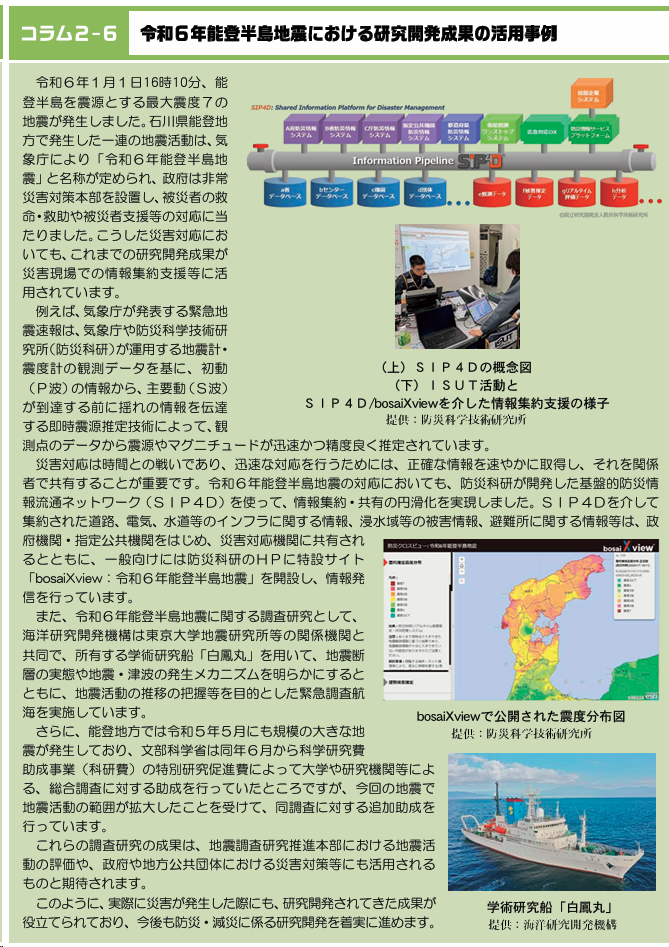
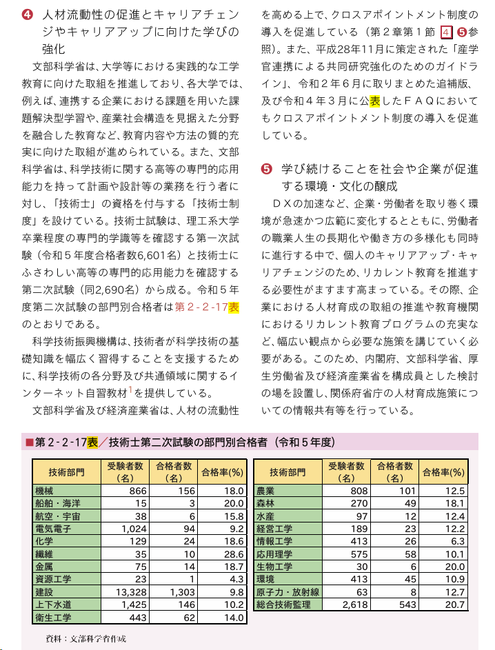
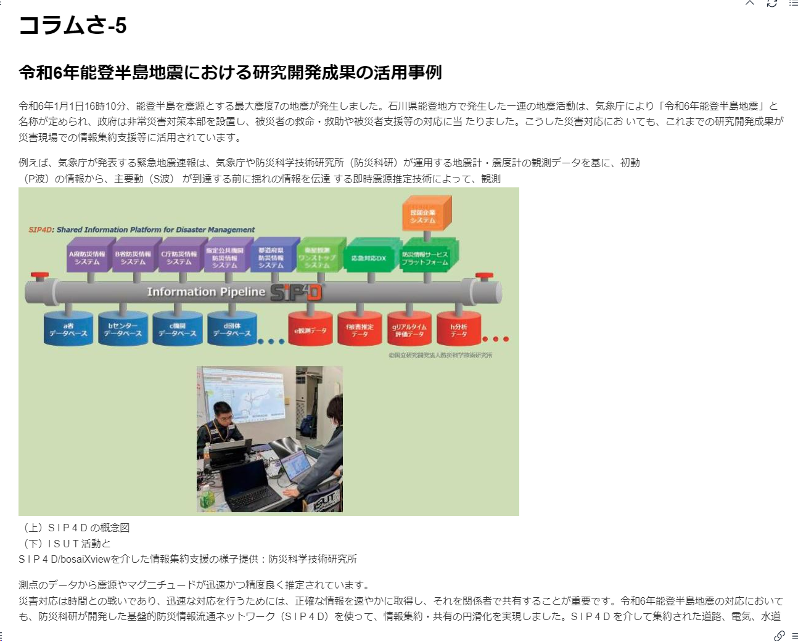
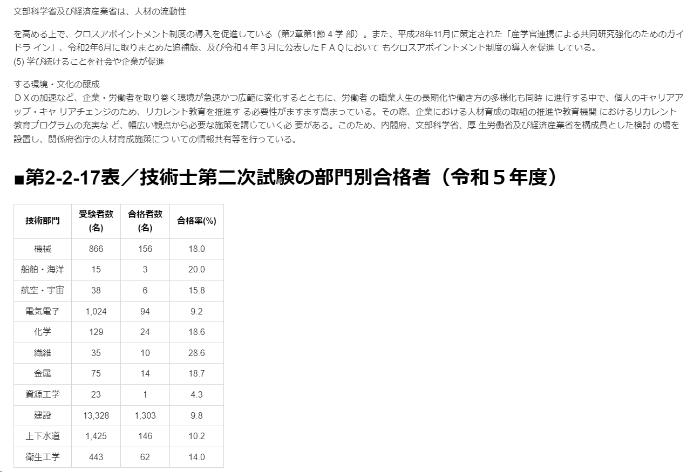
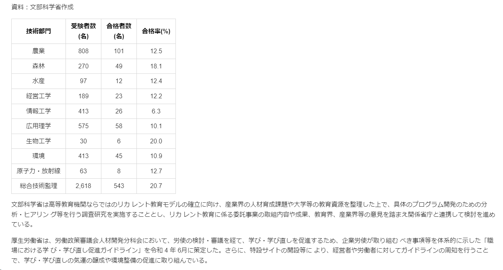

## 扱うドキュメント
今回は、以下のPDFを使って、Mistral OCRでMarkdown化を行います。
日本政府が公開している、「令和６年版_科学技術・イノベーション白書」の本文です。
**128ページあり、図や表などが含まれています。**
https://www.mext.go.jp/content/20240611-ope_dev03-000036120-9.pdf

例えば、以下のような図が文章の中に含まれています。

表については、以下のようなものが含まれています。

## Mistral AI のAPIキーを取得
Mistral OCRを使うためには、Mistral AIのAPIキーが必要です。
まだAPIKeyを持っていない場合は、以下のMistral AIのサイトでAPIキーを作成しましょう。
https://console.mistral.ai/api-keys

## 結果の確認

**図が含まれる文章は、以下のようにMarkdown形式に変換されています。**

**表が含まれる文章も、以下のようにMarkdown形式に変換されています。**

